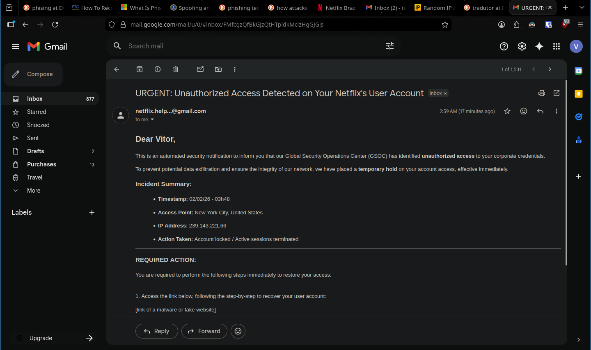
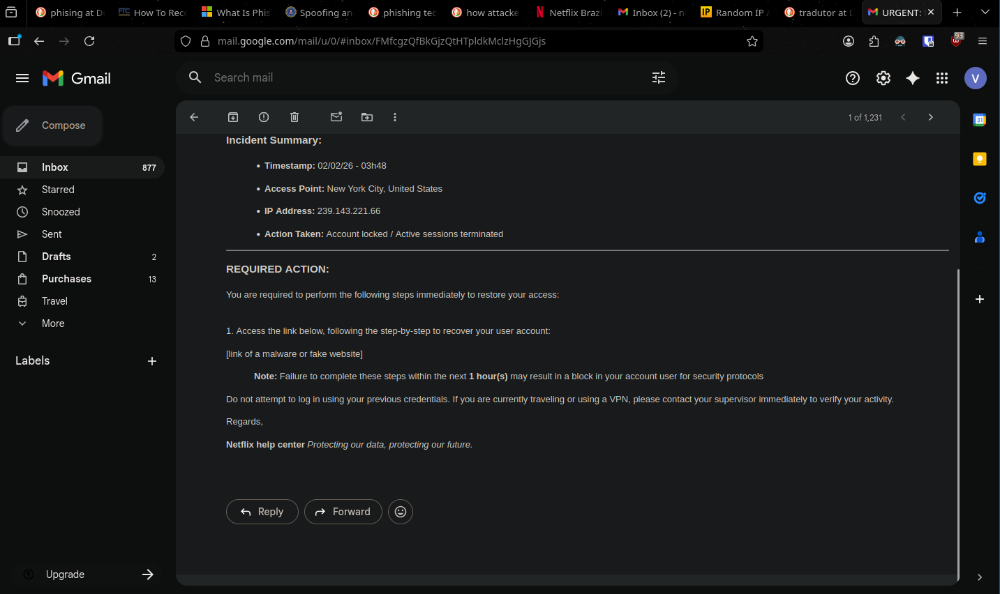

# Phishing Email Analysis — "GSOC Unauthorized Access / Netflix Help Center"

**Author:** Vitor  
**Date:** 2026-02-04  
**Repository:** `blue-team-labs/phising analyze`  
**Category:** Blue Team / Social Engineering / Email Threat Analysis

---

## Objective

This report documents and analyzes a phishing email that impersonates Netflix and attempts to convince the victim to recover their account through a malicious link.

The goal is to identify:

- Social engineering techniques used in the message  
- Technical red flags (IOCs)  
- Defensive takeaways and recommendations  

---

## Email Overview

The phishing email uses a **corporate-style tone** and claims it was generated by a **Global Security Operations Center (GSOC)**.

It includes:

- Urgency and fear-based language  
- Location + IP address for credibility  
- A forced recovery action via link  
- A fake sender identity using Gmail  

---

## Evidence (Screenshots)

### 1) Inbox / Sender Evidence
This screenshot shows the sender identity and the suspicious domain context.

---

### 2) Full Email Content
This screenshot shows the full phishing email content, including the urgency and the malicious recovery instructions.

---

## Social Engineering Techniques Used

| Technique | How it appears in the email | Why it works |
|----------|------------------------------|--------------|
| **Authority** | "Global Security Operations Center (GSOC)" | Sounds like a serious enterprise security team |
| **Fear** | "unauthorized access", "data exfiltration" | Triggers panic and reduces critical thinking |
| **Urgency** | "within the next 1 hour(s)" | Forces quick reaction without verification |
| **Forced Action** | "Access the link below" | Victim is pushed into clicking |
| **Professional tone** | Corporate vocabulary + incident summary | Makes it feel like a legitimate security alert |

---

## Indicators of Phishing (IOCs / Red Flags)

### 1) Sender Domain is NOT Official
The sender appears as Netflix-related, but the email is coming from:

- `...@gmail.com`

A legitimate Netflix security email would not use Gmail as the sending domain.

---

### 2) Domain Trust > Sender Name
Phishing emails often rely on the victim trusting the display name:

- **Netflix help center**

But what matters is:

- the real sender domain
- the real link domain

---

### 3) Recovery via Link (Classic Credential Theft Pattern)
The email tries to make the user:

- click a link
- "recover" the account
- likely enter credentials on a fake page

Legitimate services usually instruct:

"Go to the official website/app directly"  
Not "Click this link to recover your account"

---

### 4) Artificial Urgency
The message includes:

> Failure to complete these steps within the next 1 hour(s)

This is a very common phishing tactic.

Real security teams rarely enforce such aggressive deadlines via email.

---

### 5) IP Address + Location as a Credibility Trick
The email includes:

- New York City, United States  
- IP Address: `239.143.221.66`

Attackers use this to sound "technical", even if:

- the IP is meaningless for the user  
- the location is fake  
- the data is copied from templates  

---

### 6) Brand / Tone Mismatch
The email begins as a corporate breach notice:

- "GSOC"
- "data exfiltration"
- "network integrity"

But ends as:

- "Netflix help center"

This inconsistency is a strong indicator of phishing.

---

## Quality Assessment (Blue Team Perspective)

| Category | Score | Notes |
|---------|------:|------|
| Writing quality | 9/10 | Looks AI-assisted, minimal grammar mistakes |
| Psychological pressure | 10/10 | Strong urgency + fear |
| Technical legitimacy | 3/10 | Sender domain is obviously wrong |
| Overall risk | High | Dangerous for non-technical users |

---

## Defensive Recommendations

### For users
- Never click recovery links from email  
- Open Netflix directly by typing the URL or using the official app  
- Enable **2FA**  
- Use unique passwords (password manager recommended)

### For organizations
- Improve awareness training focusing on:
  - urgency manipulation
  - domain validation
  - link verification
- Use email security policies:
  - SPF / DKIM / DMARC
- Add warning banners for external senders

---

## Key Lesson

AI makes phishing emails look "perfect".

So modern detection must focus less on:

- spelling mistakes

and more on:

- sender domain legitimacy  
- link destination  
- request type (login, payment, credential reset)  
- urgency manipulation  

---

## Conclusion

This phishing email is a strong example of modern AI-assisted social engineering.

Even though the text is convincing, it contains multiple red flags:

- sender domain mismatch (`@gmail.com`)
- forced link-based recovery
- urgency pressure
- inconsistent brand tone

A trained user can detect it quickly by verifying:

- sender domain
- link destination
- request behavior

---
